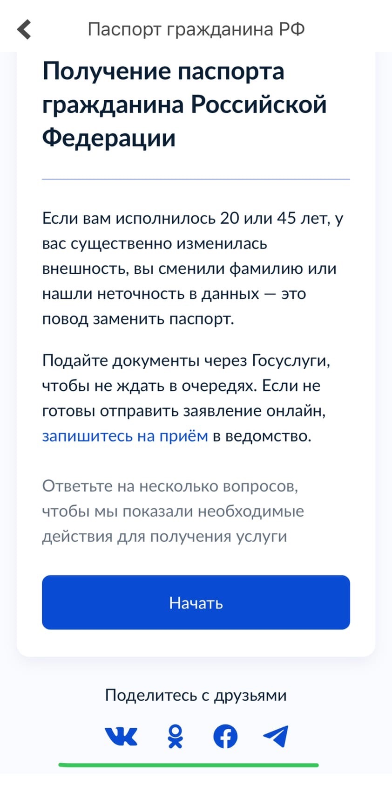

# GOSUSLUGI
Это репозиторий команды **TeamRussia** для выполнения первой практической работы по предмету ТиВПО

Выбранное програмное обеспечение: [**Госуслуги**](https://ru.wikipedia.org/wiki/%D0%9F%D0%BE%D1%80%D1%82%D0%B0%D0%BB_%D0%B3%D0%BE%D1%81%D1%83%D0%B4%D0%B0%D1%80%D1%81%D1%82%D0%B2%D0%B5%D0%BD%D0%BD%D1%8B%D1%85_%D1%83%D1%81%D0%BB%D1%83%D0%B3_%D0%A0%D0%BE%D1%81%D1%81%D0%B8%D0%B9%D1%81%D0%BA%D0%BE%D0%B9_%D0%A4%D0%B5%D0%B4%D0%B5%D1%80%D0%B0%D1%86%D0%B8%D0%B8)

Состав команды: [Артём Долгополов](https://github.com/artemdol25), [Трапизонян Раифк](https://github.com/trapizonyan).

## Оглавление

1. [Краткое описание выбранного ПО](#Краткое-описание-выбранного-ПО)
2. [Функциональная спецификация](#Функциональная-спецификация)
3. [Диаграмма вариантов использования](#Диаграмма-вариантов-использования)
4. [Баги](#Баги)

## Краткое описание выбранного ПО

«Портал госуда́рственных и муниципальных услуг Российской Федерации» (Единый портал госуслуг, ЕПГУ, кратко — Госуслуги) — справочно-информационный интернет-портал. 
Обеспечивает доступ физических и юридических лиц к сведениям о государственных и муниципальных услугах в Российской Федерации — России, государственных функциях по контролю и надзору, об услугах государственных и муниципальных учреждений, об услугах организаций, участвующих в предоставлении государственных и муниципальных услуг, а также предоставление в электронной форме государственных и муниципальных услуг. 
Все услуги, размещенные на портале, соотнесены с конкретным регионом России: место получения услуги определяет, как наличие самой услуги, так и условия её предоставления.

## Функциональная спецификация

На портале «Госуслуги»  размещена справочная информация для физических и юридических лиц о порядке оказания госуслуг, в том числе — в электронном виде, организован поиск по тематике, ведомству, жизненной ситуации, представлены образцы документов, ссылки на сервисы госучреждений и ведомств.

Кроме сайта, у портала госуслуг есть мобильное приложение. Это помощник, который помогает зарегистрироваться на портале, отслеживать статус обращений, вовремя узнавать о новых штрафах. Если вы установите приложение и настроите уведомления, приложение сразу будет сообщать вам о новом штрафе, чтобы вы его не пропустили.

## Диаграмма вариантов использования

## Баги

### Неактивные иконки соц. сетей

В разделе услуги "Получение паспорта гражданина Российской Федерации" снизу присутствуют иконки для возможности поделиться данной услугой в соц. сетях, при нажатии на них ничего не происходит.

